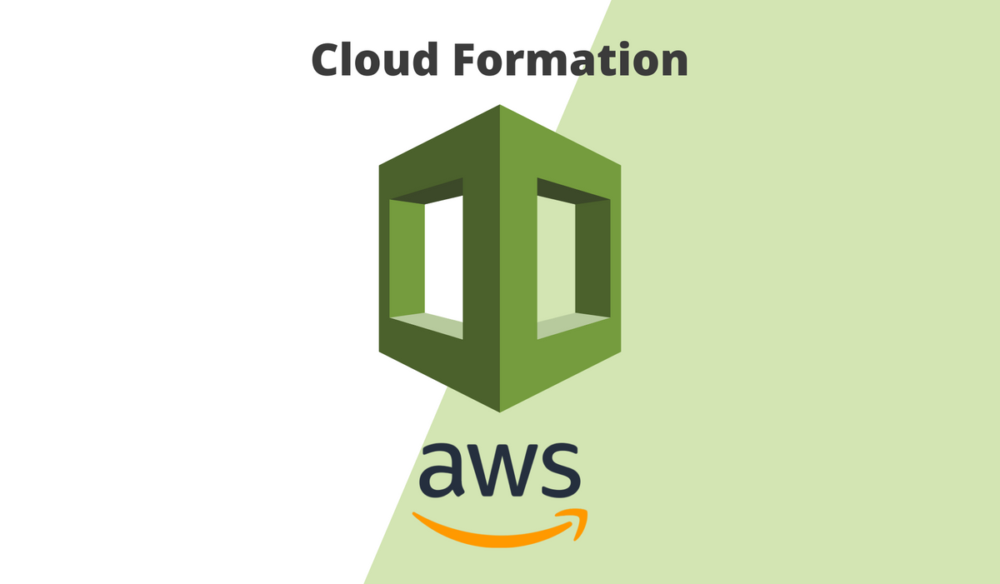

#  AWS CloudFormation Scripts

> Demystifying Infrastructure as Code (IaC) on AWS.



Additional description about the project and its features.

## Built With

- AWS CLI
- YAML

## Getting Started

TBD

### Prerequisites

TBD

### Setup

TBD

### Install

TBD

### Usage

TBD

### Deployment

Most of the time it's just:

```
$ aws cloudformation create-stack --stack-name <STACK-NAME> --template-body <FILE-PATH>
```

## Authors

👤 **Adriaan Beiertz**

- [Github](https://github.com/adriaanbd)
- [Twitter](https://twitter.com/abeiertz)
- [Linkedin](https://linkedin.com/adriaanbd)

## 🤝 Contributing

Contributions, issues and feature requests are welcome!

Feel free to check the [issues page](issues/).

## 📝 License

This project is [MIT](lic.url) licensed.
